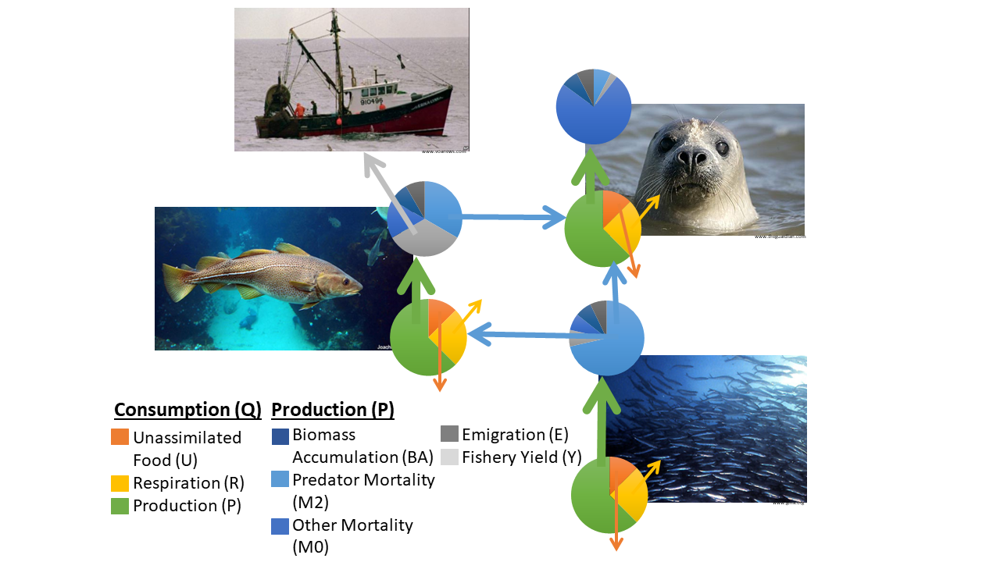
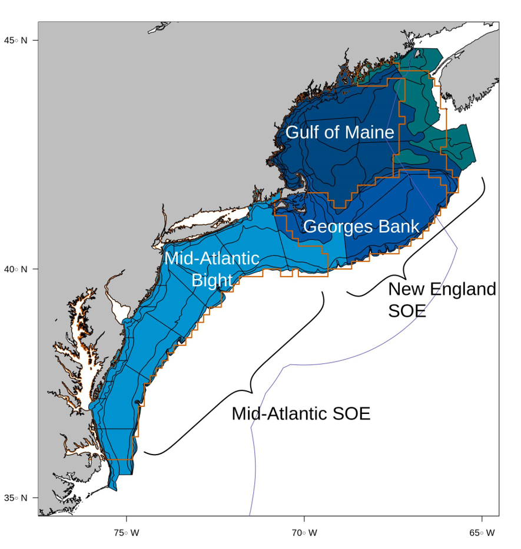
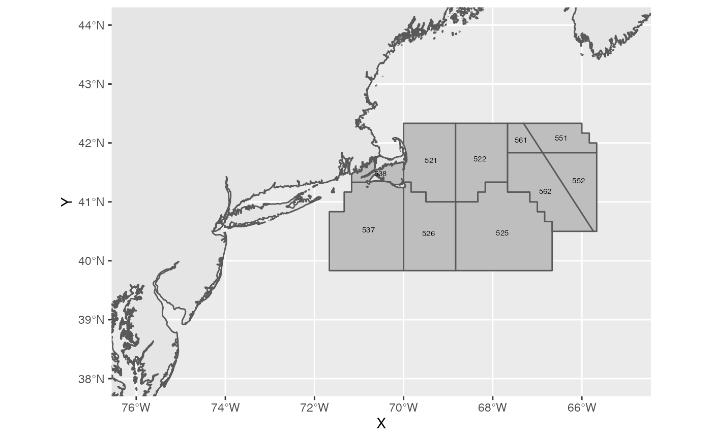

```{r Defaults, include=FALSE}
options(knitr.table.format = "latex")

#Default Rmd options
knitr::opts_chunk$set(echo     = FALSE,
                     message   = FALSE,
                     warning   = FALSE)

library(here); library(knitr); library(kableExtra); library(Rpath); 
library(data.table); library(rgdal); library(raster); library(maps); 
library(GISTools); library(ggplot2); library(sf); library(ggspatial)

#load balanced model
load(file = here('data', 'GB.params.bal.rda'))
load(file = here('data', 'GB.bal.rda'))

#Create output
GB.output <- as.data.table(write.Rpath(GB.bal))

```

```{r Rpath}
#Unbalanced version
#GB.bad <- rpath(GB.unbal)
#GB.orig <- as.data.table(write.Rpath(GB.bad))

#Balanced version
#GB <- rpath(GB.params, 'Georges Bank')
#GB.output <- as.data.table(write.Rpath(GB))

```

# Introduction
Included in the suite of MSKeyrun models is a mass balance representation of Georges Bank.  Mass balance models are a good tool for identifying and quantifying major energy flows in a system [@plaganyi_models_2007].  Mass balance models describe the ecosystem resources and their interactions which makes them good at evaluating the ecosystem effects of fishing or environmental changes as well as exploring management policy options [@plaganyi_models_2007].  The use of mass balance models was popularized through the use of Ecopath with Ecosim [EwE: @christensen_ecopath_1992; @walters_ecosim_1997; @christensen_ecopath_2004].  For MSKeyrun, I used the R version, Rpath [@lucey_rpath_2020].

Mass balance models can be used in a variety of ways.  For the ICES WGSAM review, only the initial mass balance was complete.  Mass balance is a static snapshot of the ecosystem and is a trophic model at its base [@polovina_ecopath_1984; @christensen_ecopath_1992: Figure \ref{fig:massbal-concept}].  Having a balanced model does not necessarily imply steady-state, although many models are parametrized as such.   Mass balance models can also be extended into dynamic simulations referred to as Ecosim in the EwE framework or Rsim in the Rpath framework [@walters_ecosim_1997; @lucey_rpath_2020].  Spatial processes can also be explored using the Ecospace module of EwE [@walters_ecospace_2000].  No such equivalent exists in Rpath at this time.  Future work within the MSKeyrun project will include dynamic simulations as well as tuning to time series data. 

```{r massbal-concept, fig.cap="Conceptual model of mass balance where consumption and production are balanced.  Production as described in Equation 1 as a sum of fishery yield (Y), predator mortality (M2), emigration (E), biomass accumulation (BA), and other mortality (M0 or 1 – EE).  Consumption as described in Equation 2 is a sum of production (P), unassimilated food (U) and respiration (R).", out.width='90%'}



```

This new mass balance representation of Georges Bank build off existing mass balance work that was developed as part of the Northeast Fisheries Science Center's (NEFSC) Energy Modeling and Analysis eXercise [EMAX: @link_EMAX_2006].  EMAX models were developed for both the Ecopath [@christensen_ecopath_1992; @walters_ecosim_1997; @christensen_ecopath_2004] and EcoNetwrk [@ulanowicz_econetwrk_1991] software packages.  The Georges Bank model from EMAX is highly aggregated with 29 species groups, two detrital groups, and one fishery.  This trophic structure is too coarse to be useful for management.  Many of the commercially important species are aggregated together and there is not enough resolution in the fisheries to address any meaningful trade-offs.  

A companion model from EMAX describing the Gulf of Maine was incorporated into the early stages of a management strategy evaluation (MSE) on the role of Atlantic herring, *Clupea harengus* as a forage item within the system particularly for marine mammals.  Despite EMAX being designed to describe forage fish in the region [@link_gom_2008], the results were highly uncertain with no discernible benefits due to the highly aggregated nature of the model.  Therefore the model was not pursued further within MSE (S. Gaichas personal communication).

The purpose of the MSKeyrun project is to make models that will be useful for managers.  With that goal in mind, I present a new mass balance representation of Georges Bank.  Here all commercial species have been disaggregated and the fisheries have been divided into major gear categories.  Developing the model in Rpath will also let us explore various fisheries management strategies using built in functionality [@lucey_mse_2021].

# Methods

## Mass Balance Equations
Mass balance is governed by two master equations; one describing production (Eq. \ref{Ecopath Master 1}) and the other consumption [Eq.                          \ref{Ecopath Master 2}: @christensen_ecopath_1992]. The interaction between the two gives rise to the term mass balance.  Production accounts for natural and fishery-induced mortality as well as emigration and biomass accumulation as:
  
  
\begin{equation}
  \label{Ecopath Master 1}
  P_i = Y_i + B_iM2_i + E_i + BA_i + P_i(1 - EE_i)
\end{equation}

\noindent where production, $P_i$, is the sum of a species' fishery yield, $Y_i$;
predation mortality, $M2_i$; emigration, $E_i$; biomass accumulation, $BA_i$; and
other mortality, expressed as $P_i(1-EE_i)$.  Where $EE_i$ is the ecotrophic 
efficiency or percentage of mortality explained within the model.  In this equation,
$M2_i$ is expressed as a rate and therefore multiplied by the species biomass, $B_i$.

Consumption accounts for the production expressed above as well as unassimilated 
food and respiration as:

\begin{equation}
    \label{Ecopath Master 2}
    Q_i = P_i + R_i + U_i
\end{equation}

\noindent where $Q_i$ is the total consumption, $R_i$ is respiration, and $U_i$ is unassimilated food.  Energy used for respiration is lost from the system.  Unassimilated food is the portion of consumption that is excreted and remains in the system through a detrital group.

## Parameter input
Mass balance models require several parameters that can be obtained from commonly collected data.  These parameters include biomass, catch, and food habits.  In addition, several biological parameters that relate biomass to production and consumption are required.  The following sections will outline how inputs were derived.

### Fisheries independent data
Many fish species as well as large benthic animals are routinely sampled by the NEFSC (Table \ref{tab:NEFSC groups}). For the purpose of this model the Autumn Bottom Trawl Survey [@politis_bts_2014], the Sea Scallop and Integrated Benthic Survey [@nefsc_scallop_2018], and the Atlantic Surf Clam and Ocean Quahog Survey [@jacobson_clams_2019] provided biomass estimates.  Data for years 1981 to 1985 were queried from the NEFSC survey databases.  This time period was chosen to mimic models for the Gulf of Maine and Mid-Atlantic Bight that are also under development.  

```{r NEFSC parameterized groups}
groups1 <- data.table(Group = c('AtlHerring', 'AtlMackerel', 'Butterfish', 
                                'SmPelagics', 'Mesopelagics', 'OtherPelagics', 'Cod', 
                                'Haddock', 'Goosefish', 'OffHake', 'SilverHake', 
                                'RedHake', 'WhiteHake', 'Redfish', 'Pollock', 'OceanPout', 
                                'BlackSeaBass', 'Bluefish', 'Scup', 'OtherDemersals', 
                                'SouthernDemersals', 'Fourspot', 'SummerFlounder', 
                                'AmPlaice', 'Windowpane', 'WinterFlounder', 'WitchFlounder', 
                                'YTFlounder', 'OtherFlatfish', 'SmFlatfishes', 'SpinyDogfish', 
                                'SmoothDogfish', 'Barndoor', 'WinterSkate', 'LittleSkate', 
                                'OtherSkates', 'Illex', 'Loligo', 'OtherCephalopods', 
                                'AmLobster', 'AtlScallop', 
                                'Clams'), 
                      'Data Source' = c(rep('ABTS', 40), 'Scallop', 
                                        'Clam'),
                      Classification = c(rep('Pelagic (Small; Round)', 5),
                                         'Pelagic (Medium; Round)', 
                                         'Demersal (Round)', 'Demersal (Round)',
                                         'Demersal', rep('Demersal (Round)', 6),
                                         'Demersal', 'Demersal (round)', 
                                         'Pelagic (Medium; Round)', 'Pelagic (Small; Round)',
                                         'Demersal (Round)', 'Demersal (round)',
                                         rep('Demersal (Flat)', 9), 'Demersal (Round)',
                                         'Demersal (Round)', rep('Demersal (Flat)', 4),
                                         rep('Invertebrate (Pelagic)', 3),
                                         rep('Invertebrate (Benthic)', 3)))
plank <- c('AtlHerring', 'AtlMackerel', 'SmPelagics')
pisc  <- c('Barndoor', 'Bluefish', 'Cod', 'Fourspot', 'Goosefish', 'HMS', 'OffHake', 
           'SilverHake', 'Sharks', 'SpinyDogfish', 'SummerFlounder', 'OtherPelagics')
groups1[Group %in% plank, Diet := 'Planktivore']
groups1[Group %in% pisc,  Diet := 'Piscivore']
groups1[!Classification %like% 'Invert' & is.na(Diet), Diet := 'Benthivore']
groups1[is.na(Diet), Diet := '']

kable(groups1, 'latex', longtable = T, escape = F,
      caption = "\\label{tab:NEFSC groups} Living groups for the Georges Bank Rpath model whose data were pulled directly from Northeast Fishery Science Center (NEFSC) databases.  Surveys used are the Autumn Bottom Trawl Survey (ABTS), Sea Scallop and Integrated Benthic Survey (Scallop), and the Atlantic Surf Clam and Ocean Quahog 
Survey (Clam).  Classifications and diet are those used for PREBAL calculations.", 
      booktabs = T, align = 'l')%>%
  kable_styling(latex_option = c('striped', 'repeat_header'), font_size = 8)

```

Samples pertaining to Georges Bank were identified using the same stratification as used for the NEFSC State of the Ecosystem reports (Figure \ref{fig:Study map}) Dominate or commercially important species were kept as separate species groups while less dominate/important species were grouped into aggregate species groups.  Biomass estimates were calculated as the mean for the time period as:

\begin{equation}
  \label{sweptarea}
  B_i = \frac{I}{q}\cdot\frac{A}{a}
\end{equation}

\noindent where *I* is the mean biomass per tow (converted to metric tons from kg), *A* the area of the Georges Bank
EPU, *a* the average swept area of the tows, and *q* the catchability.  Data on 
catchability is sparse so *q*'s from EMAX [@link_EMAX_2006] were applied to scale
biomass values.  Swept area biomass was then converted to a density by dividing by the area of the Georges Bank EPU to be in the proper units for the mass balance model ($t~km^{-2}$).

```{r Study map, fig.cap="Map of the Northeast US Large Marine Ecosystem broken into Ecological Production Units (red line).  The NEFSC bottom trawl survey strata are outlined in grey.  The colors represent the strata used for the NEFSC State of the Ecosystem Report.", out.width='90%'}



```

### Fisheries dependent data
For the same time period as the fishery independent data, fisheries dependent data (landings and discards) were also obtained from the NEFSC.  Landings were queried from the commercial fishery databases while discard ratios were calculated using observer data.  Due to the nature of how data is collected there is a spatial mismatch between fishery independent and fisheries dependent data (Figure \ref{fig:Fisheries map}).  Commercial landings are reported by Northwest Atlantic Fisheries Organization's Statistical Areas.  For the purpose of this study we selected statistical areas 521, 522, 523, 524, 526, 551, 552, 561, and 562.  As outlined in the MSKeyrun documentation, landings were proportioned between those inside and outside of the Georges Bank spatial footprint using the average ratio from the NEFSC bottom trawl survey.

```{r Fisheries map, fig.cap="Map of the Northwest Atlantic Fisheries Organizations Statistical Areas used to define Georges Bank.", out.width='90%'}



```

Landings data were queried by species and gear (Table \ref{tab:Non-living Groups}).  Skates are reported as a mix.  Fortunately most skates retained for human consumption are the larger Winter skate, *Leucoraja ocellata*, while the smaller Little skate, *Leucoraja erinacea*, is used as bait [@nefsc_SAW_2007].  Therefore landings identified as *Skates Uncl* were segregated based on their utilization code.  In addition to the skate reclassification, otter trawl landings were divided into small and large mesh fleets.  These two similar gear types catch vastly different suites of species.  Distinction between small and large was made using a mesh size of 6in [@garfo_small_mesh_nodate].  Landings were converted to metric tons and averaged over the time period.  Landings were then divided by the area of the Georges Bank statistical areas to be in the proper units for the mass balance model ($t~km^{-2}$).

```{r Non-living Groups}
groups3 <- data.table(Group = c('Detritus', 'Discards', 'DredgeScallop', 'DredgeClam', 
                                'Gillnet', 'Longline', 'Seine', 'PotTrap', 'OttertrawlSmall', 
                                'OttertrawlLarge', 'Midwater', 'OtherFisheries'),
                     Type = c(rep('Detritus', 2), rep('Fleet', 10)))

kable(groups3, 'latex', longtable = T, escape = F,
      caption = '\\label{tab:Non-living groups} Non-living groups for the Georges Bank Rpath model.  Fleets were parameterized using Northeast Fishery Science Center (NEFSC) databases.',
      booktabs = T, align = 'l')%>%
    kable_styling(latex_option = c('striped', 'repeat_header'), font_size = 8)

```

Observers record the disposition of catch aboard fishing vessels.  The ratio of the discarded amount of a species to the amount kept from observed trips can be expanded by the total landings to estimate total discards as:

\begin{equation}
  \label{Discards}
  D_{ig} = \overline{\frac{\sum{D_{ig}}}{\sum{K_g}}}\cdot \sum{L_g}
\end{equation}

\noindent where $D_{ig}$ are the discards for species *i* and gear *g*, $K_g$ the
retained or kept species, and $L_g$ the gear specific landings.  Observers also record incidental takes of marine mammals and other protected species.  Only records where a mortality was recorded were included as discards.  Most of the incidental take records did not include a weight.  Therefore an average weight for the species was used based on @trites_mammal_size_1998.  Similar to landings, discards were divided by the area of the Georges Bank statistical areas to be in the proper units for the mass balance model ($t~km^{-2}$).

### Food Habits
The NEFSC has been collecting food habits data since 1973 [@link_food_habits_2000].  There are over 1400 different prey items in the database so the first step was assigning all prey items to their respective species group.  Next the food habits data was queried excluding blown and empty stomachs.  Stomach contents identified as fish unclassified or animal remains were also ignored.  Stomachs were used from the entire time series to ensure enough coverage of less well studied species groups.

Percent weight of prey was calculated using the cluster design explained in @nelson_cluster_2014 as:

\begin{equation}
  \label{cluster}
  \hat{r} = \frac{\sum_{i = 1}^nM_i\hat{\mu_i}}{\sum_{i = 1}^nM_i}
\end{equation}

\noindent where $\hat{r}$ is the mean attribute of interest (in our case weight per stomach), 
$M_i$ is the total number of fish in each cluster (Station/Species group), and 
$\hat{\mu_i}$ the mean attribute in the cluster calculated as:

\begin{equation}
  \label{attribute}
  \hat{\mu_i} = \frac{\sum_{j = 1}^{M_i}{y_{ij}}}{M_i}
\end{equation}

\noindent where $y_{ij}$ is attribute of fish *j* in cluster *i*.  After calculating the 
mean weight per stomach of each prey item, percent diet by weight was calculated as:

\begin{equation}
  \label{percent}
  \%prey_i = \frac{\hat{r_i}}{\sum_{i=1}^n\hat{r_i}}
\end{equation}

### Upper and lower trophic levels
Several species groups in the model are not well represented in the NEFSC surveys as outlined above.  Most of these are upper trophic level species such as birds, sharks, and marine mammals or lower trophic levels like zooplankton and benthos (Table \ref{tab:EMAX groups}).  For those groups we utilized the parameters in the EMAX model for Georges Bank [@link_EMAX_2006]. 

```{r EMAX parameterized groups}
groups2 <- data.table(Group = c('Seabirds', 'Seals', 'BalWhale', 'ToothWhale', 'HMS', 
                                'Sharks', 'Macrobenthos', 'Megabenthos', 
                                'OtherShrimps', 'Krill', 'Micronekton', 
                                'GelZooplankton', 'Mesozooplankton', 'Microzooplankton', 
                                'Phytoplankton'), 
                      Classification = c('Bird', 'Mammal', 'Whale', 'Whale', 'HMS', 
                                         'Shark',rep('Invertebrate (Benthic)', 2),
                                         rep('Invertebrate (Pelagic)', 4), 
                                         rep('Zooplankton', 2), 'Primary Producer'),
                      Diet = c(rep('', 4), rep('Piscivore', 2), rep('', 9)))

kable(groups2, 'latex', longtable = T, escape = F,
      caption = "\\label{tab:EMAX groups} Living groups for the Georges Bank Rpath model that were parameterized using values from EMAX. Classifications and diet are those used for PREBAL calculations.", 
      booktabs = T, align = 'l')%>%
    kable_styling(latex_option = c('striped', 'repeat_header'), font_size = 8)
```

### Biological parameters
Mass balance models require biological parameters that relate biomass to production and consumption.  While more in-depth methods exist [see @aydin_alaska_2007], for this model we relied on the Northwest Atlantic Continental Shelf (NWACS) Ecosystem model [@buchheister_NWACS_2017].  This model was a shelf-wide model that used EMAX as a starting point but included many of the more disaggregated groups present in our model.  The biological parameters used in @buchheister_NWACS_2017 were based on recent individual stock assessments so there was no need to duplicate effort.  The NWACS model did have several multi-stanza groups whose parameter values were biomass weighted to be included.  For groups not present in NWACS, we queried FishBase.org [@fishbase].  Production to biomass was calculated a 1 over longevity and consumption to biomass was an average of the published studies on the site. After utilizing @buchheister_NWACS_2017 and FishBase.org, the aggregate groups *SmFlatfishes* and *OtherFlatfish* still did not have parameters.  Due to their size and position in the food web, we used the *SmPelagics* for the *SmFlatfishes* and *OtherDemersals* for the *OtherFlatfish*.

## Balancing procedures
Inevitably due to the uncertainty around parameter estimates models are not balanced.  Within
the mass balance framework, ecotrophic efficiencies (*EE*) represent the proportion of mortality explained in the model.  Therefore values greater than one are considered out of balance.  While getting a model to have no *EE*s greater than one is a good starting point, @link_prebal_2010 suggests some other criteria that should be explored. The pre-balance diagnostics (PREBAL) of @link_prebal_2010 are broken into five categories.  These are: biomass across trophic levels, biomass ratios, vital rates across trophic levels, vital rate ratios, and total production and removals.  These diagnostics follow general ecological and fishery principles.  

The Georges Bank Rpath model was balanced by hand moving sequentially down from the largest *EE* until the model was balanced.  During the balancing process, PREBAL diagnostics were consulted.  There are several ways to reduce the *EE* of a species group.  First you can increase the biomass or production of the group, second you can decrease the consumption on a group, or finally you can decrease the fishing pressure.  Consumption can be lowered by reducing the biomass of the predator, its consumption to biomass ratio, or the proportion of the prey in its diet.  Due to the large uncertainty around fishery independent data and the use of EMAX *q*s designed for different gear and more aggregate species, biomass was typically the first parameter to be manipulated.  Production and consumption rates were held within range of similar continental shelf mass balance models obtained from the Ecobase website [@colleter_ecobase_2015].  Finally, diet compositions were modified to alleviate predation.    

```{r, Balance table}
kable(GB.output, 'latex', longtable = T, escape = F, digits = 2,
      caption = '\\label{tab:Balanced model} Balanced Georges Bank model. The column type is the proportion of primary production used by the group (1 = primary producers, 0 = heterotroph) or 2 for detrital groups or 3 for fleets.  The columns biomass and removals correspond to the mass per $km^2$.  Other abbreviations are TL = Trophic Level; PB = Production to Biomass ratio; QB = Consumption to Biomass ratio; EE = Ecotrophic Efficiency (\\% mortality explained in the model); and GE = Growth Efficiency or Production to Consumption ratio.',
      booktabs = T, align = c('l', 'c', 'c', rep('r', 6))) %>%
    kable_styling(latex_option = c('striped', 'repeat_header'), font_size = 8)
```

Results
===
## Georges Bank model structure
The Georges Bank Rpath model consists of 71 groups (Tables \ref{tab:Balanced model}).  Of these, 59 are living groups comprised of individual fish and invertebrate species, aggregate fish and invertebrate groups, marine mammals, birds, primary and secondary producers, and bacteria.  There are two detrital groups representing discards and general detritus. Finally, there are 10 fleets representing the various fishing gears used on Georges Bank. The resultant food web (Figure \ref{fig:Webplot}) is highly interconnect, an expected result due to the generalist nature of many of the species. 

```{r Webplot, fig.cap = "\\label{fig:Webplot} Food web of the Georges Bank Rpath model.", out.width='90%'}

set.seed(123)
my.groups <- c(c(61, 59, 60), 
               c(48, 50, 51, 52, 53, 54, 56, 57, 58),
               c(11, 12, 26, 33, 34, 37, 47, 49, 55, 62, 63, 64),
               c(7, 8, 9, 10, 15, 21, 23, 24, 27, 28, 31, 32, 35, 36, 42, 43, 
                 44, 45, 46),
               c(1, 3, 5, 14, 19, 22, 29, 38, 39, 40, 41, 67),
               c(2, 4, 6, 13, 16, 17, 18, 25, 30, 66, 69),
               c(20, 65, 68, 70, 71))
webplot(GB.bal, labels = T, box.order = my.groups, label.cex = 0.8)

```

## Balancing
PreBal provides some rules of thumb that put your model in a realistic starting point [@link_prebal_2010].  They are also helpful during the balancing procedure.  The first criteria for PREBAL is biomass across trophic levels. The initial biomass span was six orders of magnitude which is in line with PreBal suggestion of five to seven.  The decomposition slope was 69% which is off from the 5-10% suggestion of PreBal (Figure \ref{fig:decomp}).  The reason is that PreBal uses a non-parametric rank for the x-axis whereas I used the species trophic level.  This value makes much more sense for a system that spans six orders of magnitude from phytoplankton to top predators. This should be investigated more. Biomasses for some fringe species (well below the line on figure \ref{fig:decomp}) were not increase purposely. All of these groups represent species that are only partially on the bank.  The bulk of their biomass resides outside the bank.  

```{r prebal load}

source(here::here('R', 'PreBal.R'))

load(here('data', 'spclass.GB.rda'))

```

```{r decomp, fig.cap = "\\label{fig:decomp} Biomass decomposition over trophic level.  Biomass spans six orders of magnitude and has a slope of -0.69.", out.width='90%'}

slopePlot(GB.bal)
```

During the balancing procedure, the largest deficiencies in *EE* were addressed first.  Many of these groups were poorly sampled or aggregated (or both).  This included several pelagic groups who are not sampled well in the survey.  To simplify issues that arose from aggregate groups with little to no data available their EEs were set to 0.8.  Undersampled pelagic species were increased by an order of magnitude.  In addition, all species biomasses were multiplied by 4 to better scale with fisheries data.

Several key predators needed to have their biomass reduced as well.  The most significant of these was *SpinyDogfish*.  This was a similar issue in @buchheister_NWACS_2017 most likely arising from an aggregate *q* that is not really applicable to their behavior with a trawl. There were a few situations were diet compositions were adjusted to help achieve balance.  Once again this mostly occurred with the aggregated species groups such as *OtherFlatfish* and *OtherCephalopods*.  In these cases a portion of the diet composition assigned to the species were moved to a similar species.  The other notable diet composition change occurred for three hake species groups (*RedHake*, *SilverHake*, and *WhiteHake*) where conspecific mortality was reduced.  Cannibalism can be hard to balance in these models as increasing biomass actually has an adverse effect.  So species with lower productivities (fish species) have a hard time sustaining more than 10%.

The second criteria looks at ratios between taxa groups (Figure \ref{fig:Biomass ratios}). Initial impressions led to an increase in *Phytoplankton* which improved the ratios to primary production.  Several of the ratios are greater than one which is indicative of too much predation on a prey group [@link_prebal_2010].  However, the generalist nature of many of the predators in the system means that not one prey group is experiencing all of the predation pressure from a particular group of predators.  Very small ratios are indicative of multiple trophic levels between the predator and the prey and are expected for groups like whales:zooplankton (Figure \ref{fig:Biomass ratios}:A).

```{r, fig.cap="\\label{fig:Biomass ratios} Biomass ratios for the Georges Bank Rpath model.  Top left panel displays ratios between predators and their prey.  Top right panel and bottom left display the relative energy flow through the system as ratios of aggregate groups to total fish (top right) or invertebrates (bottom left).  The bottom right panel displays the ratio between fish trophic guilds.  Abbreviations are: AF - all fish, AI - all invertebrates, Benth - benthivores, BI - benthic invertebrates, DM - demersal fish, FF - flatfish, GZ - gelatinous zooplankton, HMS - highly migratory species, MB - mammals and birds, PI - pelagic invertebrates, Pisc - piscivores, PL - pelagics, Plank - planktivores, PP - primary producers, SH - sharks and HMS, SM - shrimp, micronekton, and krill, SP - small pelagics, TL - trophic level, W - whales, ZP - zooplankton.", out.width='90%'}


GB.prebal <- prebal(GB.bal, spclass.GB)
#Turn into an object to plot
series <- c('Predator Prey Ratio', 'Energy Flows - Fish', 'Energy Flows - Invert',
            'Energy Flows - Diet')
prebal.toplot <- c()
for(i in 5:8){
  ratios <- GB.prebal[[i]]
  ratios[, Series := series[i - 4]]
  prebal.toplot <- rbindlist(list(prebal.toplot, ratios))
}


prebal.plot <- ggplot(data = prebal.toplot,
                      aes(x= Ratio, y = Value)) +
  geom_bar(stat = 'identity') +
  facet_wrap(~Series, scales = 'free')

plot(prebal.plot)
```

The third and fourth criteria are similar to criteria one and two but for vital rates (consumption, production, respiration) instead of biomass.  Similar to the biomass plots, the slopes were steeper than suggested.  Once again this is most likely due to the high productivity of Georges Bank.  There was no attempt made to correct this issue as it would have meant dramatically lowering the vital rates of lower trophic levels or raising the vital rates of mid to upper trophic levels.  Most vital rates were within range of other studies obtained from Ecobase.  Vital rate decomposition plots were consulted during the balancing process to identify outliers (Not shown).

The fifth criteria of the PREBAL diagnostics evaluates overall production and consumption.  The model did not have any groups with growth efficiencies (GE: Table \ref{tab:Balanced model} or production to consumption) that were too low or high or any with ratios greater than one.  This is good as it is not physically possible to have more production than consumption [@link_prebal_2010].  

# Discussion
Georges Bank is a highly productive region of the world's ocean; highlighted by the diverse fauna present throughout the bank and long storied history of fishing.  Our mass balance representation of Georges Bank captures that essence.  Based on the PREBAL rules of thumb for balancing marine ecosystems, Georges Bank has a steeper biomass and vital rate decomposition than typical marine systems [@link_prebal_2010].  This is indicative of the system having high primary production as well as lower biomass and production from the mid to upper trophic levels.  In addition, the food web is highly interconnected.  This aligns with the fact that most of the predators on Georges Bank are generalists, eating whatever prey is available [@link_food_habits_2000]. 

The distinct geographic and oceanographic properties of Georges Bank make it an ideal area to enact EBFM.  Of course there will be many questions surrounding the implementation of place-based strategies.  Some of which could be addressed through an MSE process.  Our Georges Bank Rpath model could serve as an operating model or contribute to a suite of operating models for that purpose.  Rpath has been designed with these types of applications in mind [@lucey_mse_2021].

As a full ecosystem model, mass balance models can encapsulate most of the species in a system. Although with any modeling approach it is not necessary to have explicit details for every trophic level [@fulton_complexity_2003].  The computational overhead for Rpath is fairly low which allows mass balance models to be included in sensitivity analysis [@gaichas_beer_2015].  The compromise is losing the ability to explore length (or age) and/or spatial questions.  While not part of this study, mass balance models can be parameterized to include multi-stanza groups which could mimic the length stanzas in Hydra [@lucey_rpath_2020].  Mass balance models can also be extended to include spatial properties if using the Ecospace algorithms of the Ecopath with Ecosim software [@christensen_ecopath_2004].   

There have been a number of mass balance models produced for the Northeast US Continental Shelf Large Marine Ecosystem.  Unfortunately they are too aggregated [i.e. @link_EMAX_2006] or not specific to the Georges Bank region [i.e. @buchheister_NWACS_2017].  Therefore we used the @link_EMAX_2006 work as a starting point supplemented by @buchheister_NWACS_2017.  The new fleet structure and species disaggregation will allow for more management policies to be explored.

Our Georges Bank model is the static snapshot of energy flow through the system.  For management purposes it should be tuned to data and ideally designated as a 'key-run' [@ices_WGSAM_2016].  'Key-runs' serve as a quality control device that provide confidence to managers that the model is appropriate for use in providing advice.  The next step in creating a 'key-run' will be to tune the model to data.  

This Georges Bank Rpath model is a good starting point for management.  The complexity of the model allows it to be flexible and inclusive.  Inevitably during the MSE process specific questions will need to be addressed.  At that time further refinement of the model and its parameters can be made.   This model refinement should take place as part of a stakeholder process to ensure the model is capturing the aspects of the system in which they are interested [@fulton_EBFM_MSE_2014; @goethel_stakeholders_2018].


# References
